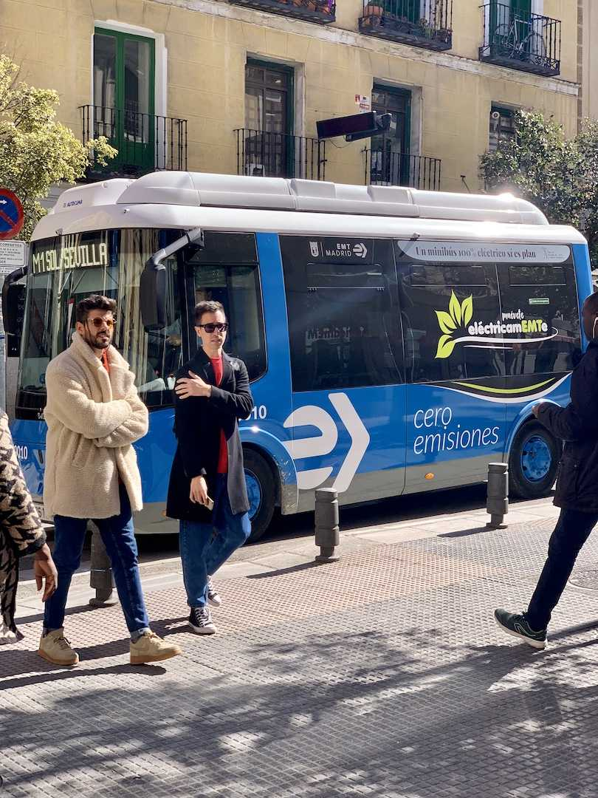
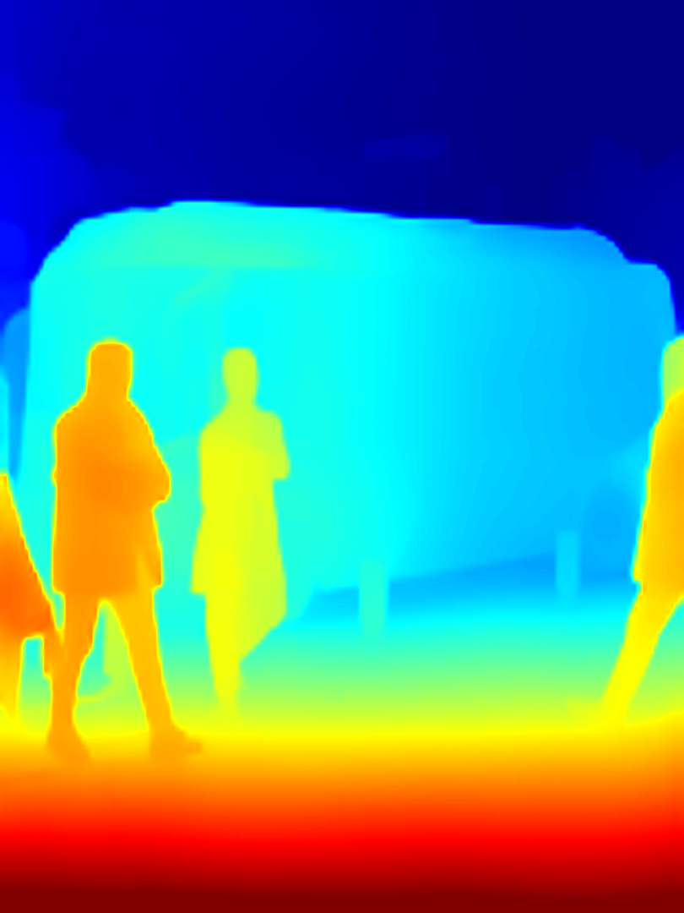

# YOLO26-Depth RKNN

YOLO26-Depth 单目深度估计模型在 RK3588 NPU 上的完整部署方案。

**PT → ONNX → RKNN → NPU 推理**，支持 n/s/m/l/x 五种模型，推荐 **rect 导出**（非正方形）与 ultralytics 原版逐像素对齐。

## 效果展示

| 输入原图 | x 模型深度估计（RKNN NPU，601ms） |
|:---:|:---:|
|  |  |

### 5 个型号对比


每行一个型号（n → x），五列分别为 **PT 原版**、**ONNX CPU**、**Python/RKNN**、**Rust/RKNN**、**C++/RKNN**。所有推理路径的输出高度一致，PT→RKNN 全链路误差 < 0.52%，三种语言的 RKNN 输出相关系数 > 0.99999。

## 性能

RK3588 实测（bus.jpg，FLOAT16，librknnrt 2.3.2 + performance governor，warmup 3 + 平均 15~20 次）：

| 模型 | 分辨率 | RKNN NPU | FPS |
|------|--------|----------|-----|
| n | 640 | 94 ms | 10.6 |
| s | 640 | 128 ms | 7.8 |
| m | 640 | 238 ms | 4.2 |
| l | 640 | 285 ms | 3.5 |
| x | 640 | 603 ms | 1.7 |

对比 ONNX CPU（RK3588 A76）：x/640 为 2748 ms，NPU 加速约 4.6x。

### 性能调优（重要）

默认板卡配置下 n 模型约 224 ms，两步优化后降至 94 ms（**2.4 倍**）：

1. **升级板端 runtime**（收益最大）。旧版 librknnrt（如 1.6.0）跑 toolkit 2.3.2 编译的模型只有一半速度。从 [rknpu2 仓库](https://github.com/airockchip/rknn-toolkit2/tree/master/rknpu2/runtime/Linux/librknn_api/aarch64) 取与 toolkit 匹配的版本：
   ```bash
   sudo cp librknnrt.so /usr/lib/librknnrt.so
   ```

2. **锁定 NPU/CPU 频率**。默认 ondemand governor 空闲降频：
   ```bash
   echo performance | sudo tee /sys/class/devfreq/fdab0000.npu/governor
   for p in /sys/devices/system/cpu/cpufreq/policy*/scaling_governor; do
       echo performance | sudo tee $p; done
   ```

3. **NPU 多核吞吐**：多线程各绑一个核，吞吐接近 3 倍：

   | 模型 | workers | 吞吐 | 单帧延迟 |
   |------|---------|------|----------|
   | n | 3 | 28.6 FPS | 102 ms |
   | n | 6 | **33.3 FPS** | 172 ms |
   | x | 3 | **4.2 FPS** | 679 ms |

### 关于 INT8 量化（不推荐）

| 模型 | FP16 | INT8 | 提速 | INT8 平均相对误差 |
|------|------|------|------|-------------------|
| n | 94 ms | 77 ms | 1.2x | 33% |
| x | 603 ms | 279 ms | 2.2x | 52% |

原因：模型输出端有 `exp()`，log 深度上的微小量化误差会被指数放大；attention 块（逐层分析 cosine 掉到 0.76）也是重灾区。**建议始终使用 FP16（`-float.rknn`）**。

## 与原版精度对比

bus.jpg（810×1080，4:3），以 ultralytics 原版 `YOLO().predict()` 输出为基准：

### 全链路误差（5 个型号）

| 型号 | PT → ONNX (768×576) | PT → RKNN (768×576) |
|------|---------------------|---------------------|
| n | 0.02% | 0.52% |
| s | 0.02% | — |
| m | 0.02% | — |
| l | 0.02% | — |
| x | 0.02% | — |

转换链路本身近乎无损。RKNN FP16 引入的额外误差（ONNX→RKNN 0.16%）来自 NPU 计算精度，不影响实际使用。

### 方形 vs Rect 对比

| 方式 | 相对误差 | 说明 |
|------|----------|------|
| RKNN 640×640 拉伸 | 11.8% | 宽高比失真，深度图明显偏差 |
| RKNN 768×576 rect | **0.52%** | 与原版逐像素一致 |

rect 导出 + 匹配宽高比的图片 = 与原版一致。

## 模型管线

```
输入 BGR uint8 (任意尺寸)
  → rect 预处理：根据图片宽高比计算 stride-32 对齐的输入尺寸
  → cv2.resize → 模型输入尺寸（保持宽高比，不填充不拉伸）
  → BGR → RGB, uint8 NHWC (RKNN) / float32 NCHW (ONNX)
  → NPU / CPU 推理
  → [1,1,H,W] float32 米制深度
  → cv2.resize → 原图尺寸
  → 热力图 / 点云
```

模型内部已烘焙 `exp(clamp(log_depth))` 和 4x 上采样，NPU 输出即为正的米制深度值。

## 用法

### 环境

**x86 开发机（导出 + 转换）**
```bash
pip install -r requirements.txt
```
需要 rknn-toolkit2 ≥ 2.3.0、torch ≥ 2.0、onnx opset 19。

**RK3588 板端（推理）**
```bash
pip3 install opencv-python numpy onnxruntime
# rknn-toolkit-lite2 通常预装
```

### 快速上手

```bash
# 1. 导出 ONNX（x86，无 .pt 时自动从 ultralytics 下载）
python export.py --model yolo26n-depth.pt --imgsz 768x576

# 2. 转换 RKNN（x86）
python convert.py --model yolo26n-depth_768x576.onnx

# 3. 推理（RK3588，三种语言任选）
python python/rknn/inference_rknn.py --model yolo26n-depth_768x576-float.rknn --image bus.jpg --save result.png
```

### 模型导出

支持 n/s/m/l/x 五种模型，本地不存在时自动下载：

```bash
python export.py --model yolo26x-depth.pt --imgsz 768   # 单个
python export.py --all --imgsz 640                        # 全部
python export.py --model yolo26x-depth.pt --imgsz 640 768 960 1280  # 多分辨率
```

### Rect 导出（推荐）

ultralytics 原版单图推理用 **rect 模式**，本项目推理端已实现相同的 rect 预处理。导出与相机宽高比匹配的 rect 模型即可完全对齐原版：

```bash
# 4:3 相机（1080×810），PT 默认 imgsz=768 → rect 768×576
python export.py --model yolo26n-depth.pt --imgsz 768x576
python convert.py --model yolo26n-depth_768x576.onnx

# 16:9 相机（1920×1080），imgsz=640 → rect 352×640
python export.py --model yolo26n-depth.pt --imgsz 352x640
```

推理端自动从模型名读取输入尺寸，无需额外参数。

### 板端推理

**Python**
```bash
python python/rknn/inference_rknn.py --model model.rknn --image img.jpg --save overlay.png
python python/rknn/inference_rknn.py --model model.rknn --image img.jpg --benchmark 100
```

**Rust**（需板端 `librknnrt.so`）
```bash
cargo build --release
./target/release/yolo26depth-rknn --model model.rknn --image img.jpg --output depth.png
./target/release/yolo26depth-rknn --model model.rknn --image img.jpg --benchmark 100
```

**C++**（需 OpenCV4 + `librknnrt.so`）
```bash
cd cpp/src && cmake -B build -DCMAKE_BUILD_TYPE=Release && cmake --build build -j
./build/yolo26depth-cpp --model model.rknn --image img.jpg --save overlay.png
```

**ONNX CPU 对比**
```bash
python python/onnx/inference_onnx.py --model model.onnx --image img.jpg --save result.png
```

### 点云生成

```bash
python depth_to_pointcloud.py --depth depth.npy --image bus.jpg --output pointcloud.ply --downsample 2
```

### 公共参数

| 参数 | 说明 |
|------|------|
| `--save` | 保存叠加图 |
| `--save-heat` | 保存热力图 |
| `--save-depth` | 保存原始深度 |
| `--mode` | `disparity`（默认）或 `metric` |
| `--benchmark N` | Benchmark N 次 |
| `--core` | NPU 核选择：auto / 0 / 1 / 2 / 012 |

## 文件结构

```
├── export.py                  # PT → ONNX 导出
├── convert.py                 # ONNX → RKNN 转换
├── depth_to_pointcloud.py     # 深度图 → 点云 PLY
├── python/                    # Python 推理
│   ├── rknn/inference_rknn.py
│   ├── onnx/inference_onnx.py
│   └── common/yolo26depth_rknn/utils.py
├── rust/                      # Rust 推理
│   ├── src/{main,lib,rknn,preprocess,postprocess,pointcloud,cli,error}.rs
│   └── examples/benchmark_pool.rs
├── cpp/src/                   # C++ 推理
│   ├── main.cpp, rknn_model.{h,cpp}, preprocess.{h,cpp}
│   ├── postprocess.{h,cpp}, rknn_rt.h, CMakeLists.txt
├── examples/python/benchmark_pool.py
├── assets/                    # 展示图片
└── README.md
```

## 常见问题

### 深度值异常大（100m+）

ONNX 推理忘记 `/255.0` 归一化。RKNN 不需要（内部处理）。

### 宽高比不匹配警告

```
UserWarning: Image aspect ratio (810:1080) does not match model aspect ratio (640:640).
  Rect input would be 640x480 but model expects 640x640.
```

说明当前图片的宽高比与模型输入尺寸不一致。解决：导出 rect 模型 `--imgsz 768x576`（4:3 相机）或 `--imgsz 352x640`（16:9 相机）。

### RKNN build 报 `IndexError`

需要保留 `DISABLE_RULES` 配置（`convert.py` 已内置）。

### n/s 模型输出 160×160

这是旧版导出的问题。用 `export.py` 重新导出，输出即为完整的 640×640。
